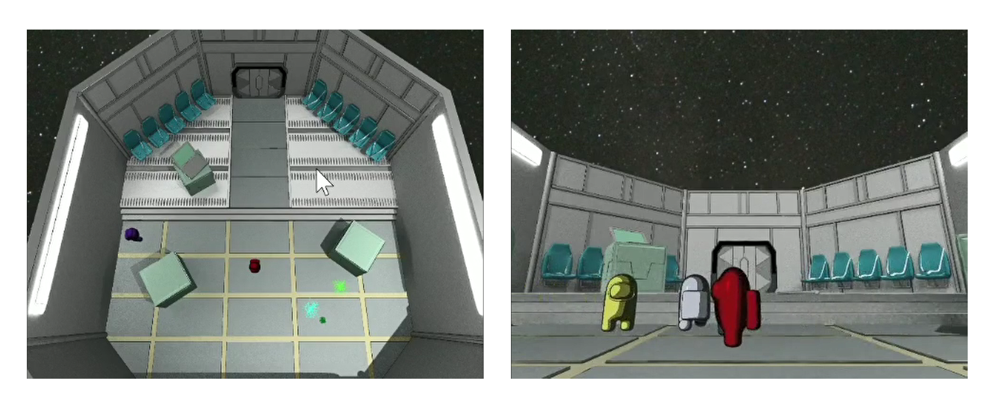

---
# Feel free to add content and custom Front Matter to this file.
# To modify the layout, see https://jekyllrb.com/docs/themes/#overriding-theme-defaults

layout: default
---

# Projects   &nbsp;&nbsp; [<span style="color:gray">Résumé</span>](./resume) &nbsp;&nbsp; [<span style="color:gray">Blogs</span>](./blogs) 
---
<!-- * This will become a table of contents (this text will be scrapped).
{:toc} -->

## VR Games

### Classroom Design Tool

> [Project in CSE 165 Winter 2021 @ UCSD](http://ivl.calit2.net/wiki/index.php/Project3W21)

### Building Blocks

> [Project in CSE 165 Winter 2021 @ UCSD](http://ivl.calit2.net/wiki/index.php/Project4W21)

## PC Games

### Among Us Lobby in 3D

> [Project in CSE 167 Fall 2020 @ UCSD](http://ivl.calit2.net/wiki/index.php/Project4F20)



3D version of the lobby in the game Among Us. NPC (non-player characters) will be randomly generate, move around, and de-spawn after a period of time. Actions of the characters (walking, appearing and disappearing) are roughly animated.

One character will be controlled by the user. User could determine its color, control its movement with keyboard keys. Footstep sounds will be played if the player's character is moving.

**Tags**: OpenGL, irrKlang \| Toon Shading, Collision Handling, Particle System Rendering

 <a href="/projects/2021/03/18/among-us-lobby-3d.html">Read the post <i class="fa fa-arrow-circle-right"></i></a>


### Social Distancing

> [Project in CSE 165 Winter 2021 @ UCSD](http://ivl.calit2.net/wiki/index.php/Project1W21)

### COVID Testing Navigation at UCSD

> [Project in CSE 165 Winter 2021 @ UCSD](http://ivl.calit2.net/wiki/index.php/Project2W21)

**Keywords**: Unity \| Travel and Wayfinding

## Animation and Physics Simulation

### Character Animation

> Project in CSE 169 Winter 2021 @ UCSD

### Cloths Simulation

> Project in CSE 169 Winter 2021 @ UCSD

### General-Purpose Particle System

> Project in CSE 169 Winter 2021 @ UCSD

## Other

### MIPS Instruction Set CPU

### C1 Language Compiler


<br>
 <a href="#top"><i class="fa fa-angle-double-up fa-lg"></i> Back to top</a>


<!-- 
Text can be **bold**, _italic_, or ~~strikethrough~~.

[Link to another page](./another-page.html).

There should be whitespace between paragraphs.

There should be whitespace between paragraphs. We recommend including a README, or a file with information about your project.

# Header 1

This is a normal paragraph following a header. GitHub is a code hosting platform for version control and collaboration. It lets you and others work together on projects from anywhere.

[](https://youtu.be/57dJAOEsqvI "Test Video")

<iframe width="420" height="315" src="http://www.youtube.com/embed/dQw4w9WgXcQ" frameborder="0" allowfullscreen></iframe>


## Header 2

> This is a blockquote following a header.
>
> When something is important enough, you do it even if the odds are not in your favor.

### Header 3

```js
// Javascript code with syntax highlighting.
var fun = function lang(l) {
  dateformat.i18n = require('./lang/' + l)
  return true;
}
```

```ruby
# Ruby code with syntax highlighting
GitHubPages::Dependencies.gems.each do |gem, version|
  s.add_dependency(gem, "= #{version}")
end
```

#### Header 4

*   This is an unordered list following a header.
*   This is an unordered list following a header.
*   This is an unordered list following a header.

##### Header 5

1.  This is an ordered list following a header.
2.  This is an ordered list following a header.
3.  This is an ordered list following a header.

###### Header 6

| head1        | head two          | three |
|:-------------|:------------------|:------|
| ok           | good swedish fish | nice  |
| out of stock | good and plenty   | nice  |
| ok           | good `oreos`      | hmm   |
| ok           | good `zoute` drop | yumm  |

### There's a horizontal rule below this.

* * *

### Here is an unordered list:

*   Item foo
*   Item bar
*   Item baz
*   Item zip

### And an ordered list:

1.  Item one
1.  Item two
1.  Item three
1.  Item four

### And a nested list:

- level 1 item
  - level 2 item
  - level 2 item
    - level 3 item
    - level 3 item
- level 1 item
  - level 2 item
  - level 2 item
  - level 2 item
- level 1 item
  - level 2 item
  - level 2 item
- level 1 item

### Small image


### Large image


### Definition lists can be used with HTML syntax.

<dl>
<dt>Name</dt>
<dd>Godzilla</dd>
<dt>Born</dt>
<dd>1952</dd>
<dt>Birthplace</dt>
<dd>Japan</dd>
<dt>Color</dt>
<dd>Green</dd>
</dl>

```
Long, single-line code blocks should not wrap. They should horizontally scroll if they are too long. This line should be long enough to demonstrate this.
```

```
The final element.
``` -->